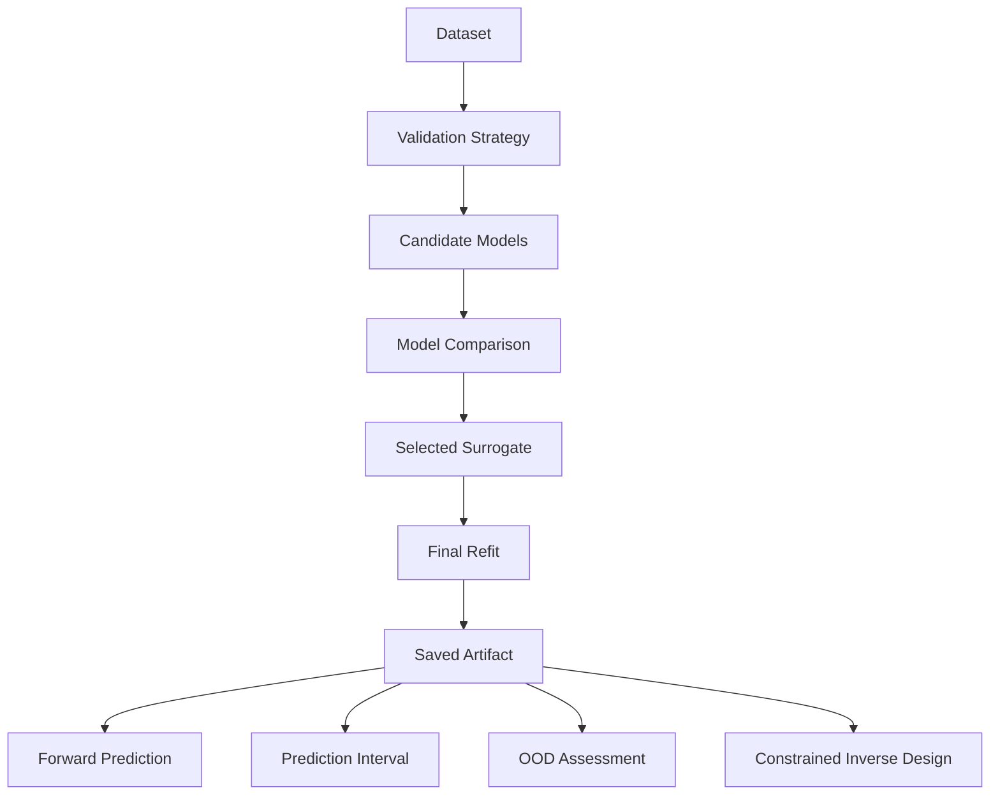
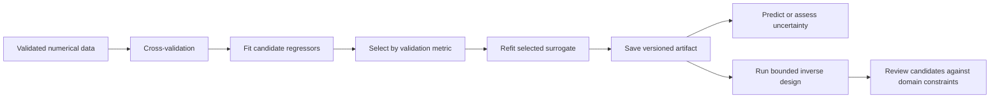

# Numerical Surrogate Toolkit

> Cross-validated numerical surrogate models for forward prediction, uncertainty assessment, and constrained inverse design.

[](https://github.com/kfat77/universal-adaptive-black-box/actions/workflows/test.yml)
[](pyproject.toml)
[](LICENSE)

## Project Overview

Numerical Surrogate Toolkit learns regression-based surrogate models from numerical tabular data when an explicit input-output equation is unavailable or impractical. It compares several candidate regressors with cross-validation, refits the selected surrogate on all observations (or development observations when split conformal calibration is requested), and supports prediction and bounded inverse design.

The project is intentionally limited to supervised regression on numerical tabular data. It is not a universal black-box system or a general machine-learning framework.

## Why This Project Exists

Researchers and engineers often have measured or simulated data but need a fast approximation for prediction, parameter search, or experimental design. This toolkit provides a small, inspectable workflow for that setting without requiring users to start from a physical formula.

## Key Features

- Numerical CSV, XLS, XLSX, NumPy, and multi-output regression workflows
- Dummy, linear, Ridge, MLP, random forest, Extra Trees, and histogram gradient-boosting candidates
- K-fold, repeated K-fold, grouped, leave-one-group-out, time-series, and holdout validation
- Scale-aware MSE, RMSE, MAE, R2, and normalized RMSE metrics with output weights
- Cross-validation residual prediction intervals and nearest-neighbour OOD assessment
- Bounded inverse design with tolerances, constraints, fixed variables, reference distance, and OOD penalties
- Active-learning recommendations and Pareto non-dominated filtering
- Versioned, metadata-rich model artifacts with legacy v1 loading support

## Supported Scope

| Area | Support |
| --- | --- |
| Data | Numerical tabular inputs and continuous targets |
| Learning | Supervised single- and multi-output regression |
| Prediction | Point prediction and residual-calibrated intervals |
| Inverse design | Bounded continuous optimization with callable constraints |
| Validation | KFold, RepeatedKFold, GroupKFold, LeaveOneGroupOut, TimeSeriesSplit, holdout |

## Unsupported Scope

| Area | Status |
| --- | --- |
| Images, audio, text, NLP, classification | Not supported |
| Reinforcement, online, or causal learning | Not supported |
| Symbolic regression and equation discovery | Not supported |
| Discrete/categorical optimization | Not supported |
| Physical feasibility or causal guarantees | Not provided |

## Intended Users

This toolkit is for researchers and engineers working with numerical experiments, simulation outputs, materials, manufacturing, biomedical measurements, and process-optimization data. It is not suitable for unvalidated high-stakes deployment, media data, time-series forecasting, or problems requiring a causal or physical proof.

## Architecture



## Installation

Requires Python 3.10 or later.

```powershell
git clone https://github.com/kfat77/universal-adaptive-black-box.git
cd universal-adaptive-black-box
python -m pip install -e .[excel]
```

For development tools:

```powershell
python -m pip install -e .[excel,dev]
```

## Quick Start

```python
from adaptive_surrogate import AdaptiveBlackBox
import numpy as np

X = np.linspace(-3.0, 3.0, 100).reshape(-1, 1)
Y = np.sin(X)

engine = AdaptiveBlackBox(epochs=100).fit(X, Y)
print(engine.model_name, engine.metrics[engine.model_name]["nrmse"])
print(engine.predict([[1.0]]))
```

When training comes from a CSV/XLS/XLSX file, pass the validated column names to
`fit(feature_names=dataset.feature_names, target_names=dataset.target_names)` to
store the training schema in the saved artifact.

## Workflow



## Forward Prediction and Uncertainty

```python
prediction, lower, upper = engine.predict_interval([[1.0]], confidence=0.90)
assessment = engine.assess_distribution([[1.0]])
```

The default `cv_residual` interval uses cross-validation residuals as a lightweight heuristic. For an independent calibration set, train with `uncertainty_method="split_conformal"`; this keeps calibration rows out of final model fitting. Both methods rely on exchangeability, can be unstable on small samples, and are not physical, causal, or distribution-shift guarantees.

## Inverse Design

```python
from adaptive_surrogate import InverseSolver

engine.save("artifacts/model.joblib")
solver = InverseSolver("artifacts/model.joblib")
solutions = solver.inverse_solve(
    Y_target=[0.5],
    x_bounds=[(-3.0, 3.0)],
    target_tolerance=0.02,
    constraints=[lambda x: x[0] >= -2.5],
    linear_constraints=[{"coefficients": [1.0], "lower": -2.5, "upper": 2.5}],
    reference_x=[0.0],
    distance_penalty=0.1,
)
```

Each inverse result includes target error, optimizer status, target-reached status, feasibility, OOD risk, constraint violation, and objective components. A result is a candidate under the learned surrogate; it does not automatically prove real-world feasibility.

## Active Learning and Pareto Utilities

```python
from adaptive_surrogate import recommend_next_experiments, non_dominated_mask

recommendations = recommend_next_experiments(engine, [(-3.0, 3.0)], n_recommendations=3)
mask = non_dominated_mask([[1.0, 5.0], [2.0, 3.0]], ["minimize", "maximize"])
```

Experiment recommendations do not execute experiments. Pareto filtering operates on supplied predicted objective values.

## Examples

The executable examples use only synthetic data and are available in [`examples/`](examples):

- `basic_workflow.py` — train, compare, and predict.
- `linear_baseline.py` — compare Dummy, linear, and Ridge baselines.
- `multi_output.py` — train a named multi-output model with output weights.
- `constrained_inverse_design.py` — save an artifact and search with a constraint and preference penalty.
- `uncertainty_ood_active_learning.py` — inspect intervals, OOD indicators, and candidate experiment suggestions.
- `pareto_design.py` — filter a predicted multi-objective candidate pool to a Pareto front.

Run the original end-to-end sine demonstration with `python main.py`.

## API Summary

| Component | Main operations |
| --- | --- |
| `AdaptiveBlackBox` | `fit`, `predict`, `predict_interval`, `assess_distribution`, `save`, `load` |
| `ForwardSolver` | Load an artifact and call `predict` |
| `InverseSolver` | Load an artifact and call `inverse_solve` with bounds plus callable or affine constraints |
| `load_tabular_data` | Validate selected numerical CSV/XLS/XLSX columns into `TabularDataset` |
| `recommend_next_experiments` | Propose candidate locations; it never runs a physical experiment |
| `non_dominated_mask` | Identify Pareto non-dominated rows in supplied objective values |

Additional engine methods are `compare_data_distribution` (reports drift without adapting the model), `refit` (explicit offline retraining), and `recommend_next_experiments` (an engine-level wrapper around the experimental recommendation utility).

## Model Evaluation

The default selection metric is normalized RMSE so large-scale outputs do not dominate a multi-output task. Use `output_weights` to express relative output importance and `selection_metric` to select a different supported metric. The `balanced` and `thorough` search budgets optimize that same metric with those same weights. MLP early stopping preserves group boundaries for group validation and uses the latest rows for time-series validation.

## Limitations and Safety

- Cross-validation does not replace an independent test set.
- Surrogates may extrapolate poorly outside observed training data.
- OOD scores are lightweight distance-based indicators, not proof of safety.
- Inverse results require domain review and independent experimental validation.
- Artifacts use pickle. Load only artifacts from trusted sources.

## Development

```powershell
python -m ruff check src tests
python -m ruff format --check src tests
python -m mypy src/adaptive_surrogate
python -m pytest
python -m pytest --cov=adaptive_surrogate --cov-fail-under=85
python -m build
```

For compatibility notes, see the [0.1 to 0.2 migration guide](docs/migration-v0.1-to-v0.2.md). The small synthetic smoke benchmarks live in [`benchmarks/`](benchmarks); they are not domain-performance claims.

## Roadmap

Implemented: numerical regression, model comparison, uncertainty intervals, OOD assessment, constrained inverse design, active-learning recommendations, and Pareto filtering.

Experimental: active-learning recommendation and Pareto utilities.

Planned: richer objective specifications, discrete-variable optimization, more robust conformal methods, broader benchmark suites, and expanded examples.

See the detailed [roadmap](ROADMAP.md) and [changelog](CHANGELOG.md).

## Citation

If you use this project in research, cite the repository and the exact release or commit used:

```text
kfat77. Numerical Surrogate Toolkit. GitHub repository.
https://github.com/kfat77/universal-adaptive-black-box
```

## License

Released under the [MIT License](LICENSE).
